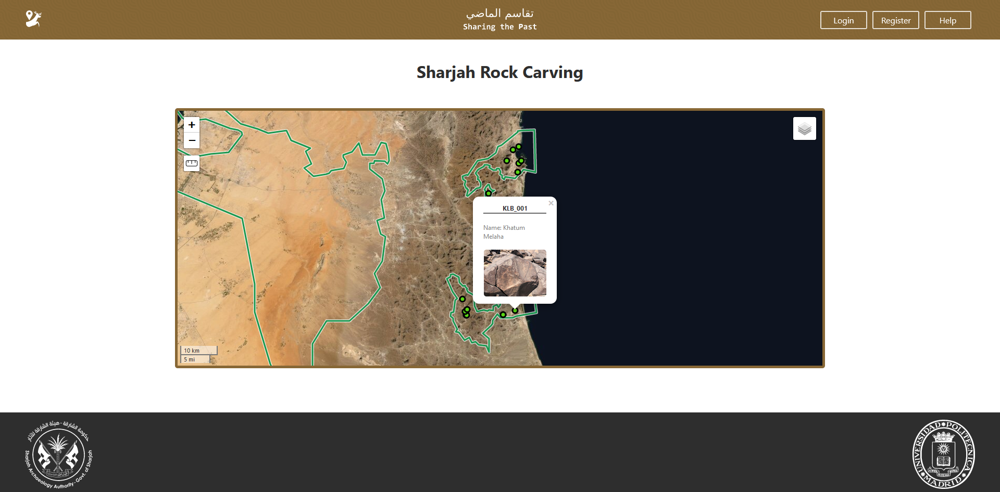
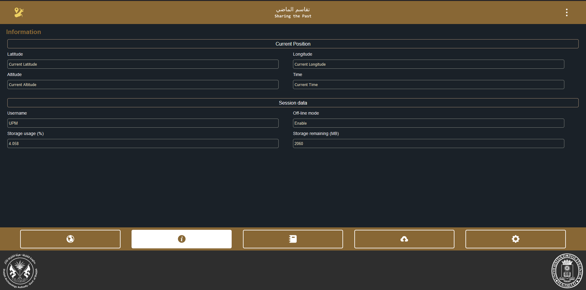
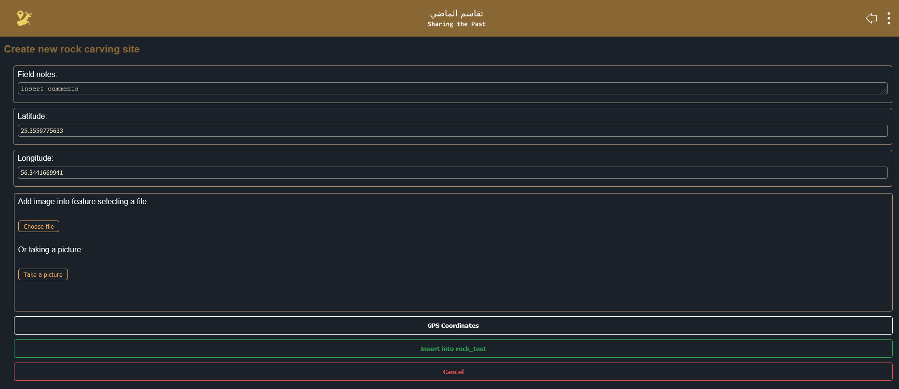

## Proyecto
- Objetivo: Inventariar grabados en roca, tomar coordenadas, notas y fotografías. Requisitos adicionales:
  - Edición colectiva
  - Registro de usuarios
  - Control de cambios
  - Modo sin conexión
- Aplicaciones de toma de datos existentes (QField, ArcGis Collector) no permitían el control de cambios por parte de un administrador y el registro de usuarios.
- Solución: Creación de una aplicación WEB
  - Versátil, cualquier usuario con un navegador actualizado puede utilizarla **sin necesidad de descarga**
  - Utilizar las APIs que permiten la edición offline de forma sencilla (IndexedDB, Service Workers)
  - Estilo personalizado

```{r lenguajes_utilizados, fig.cap='Lenguajes de programación utilizados.', out.width='80%', fig.asp=.75, fig.align='center'}
knitr::include_graphics("lenguajes.png")
```

## Página de inicio
```{r app_index, fig.cap='Pantalla de inicio', out.width='80%', fig.asp=.75, fig.align='center'}

```

## Usuarios y registro
- Administrador principal
  - Dar de alta nuevos usuarios
  - Eliminar usuarios
  - Validar los cambios
- Investigadores
  - Insertar yacimientos
  - Editar "
  - Eliminar "
  - Añadir imágenes
  
```{r app_registro, fig.cap='Pantalla de registro', out.width='80%', fig.asp=.75, fig.align='center'}

```

## Login
- Entrada a la aplicación con validación de usuarios.

```{r app_login, fig.cap='Pantalla de login', out.width='80%', fig.asp=.75, fig.align='center'}

```

## Aplicación
```{r app_main, fig.cap='Aplicación web', out.width='80%', fig.asp=.75, fig.align='center'}
knitr::include_graphics("app_main.png")
```

### Funciones principales
- Localización

```{r app_location, fig.cap='Localizacíon GPS.', out.width='80%', fig.asp=.75, fig.align='center'}
knitr::include_graphics("app_location.png")
```

- Opciones del menú superior

```{r app_smallmenu, fig.cap='Menú superior.', out.width='80%', fig.asp=.75, fig.align='center'}
knitr::include_graphics("app_smallmenu.png")
```

- Información de posición y variables de sesión

```{r app_info, fig.cap='Información de posición y de sesión.', out.width='80%', fig.asp=.75, fig.align='center'}

```

- Menú de capas
```{r app_layers, fig.cap='Menu con las opciones de la capa de yacimientos.', out.width='80%', fig.asp=.75, fig.align='center'}
knitr::include_graphics("app_layers.png")
```

- Tabla de atributos
  - Localizar un yacimiento en el mapa
  - Toma foto
  - Editar registro
  - Eliminar yacimiento

```{r app_atributos, fig.cap='Tabla de atributos y funciones específicas.', out.width='80%', fig.asp=.75, fig.align='center'}
knitr::include_graphics("app_attrTable.png")
```

### Editar base de datos
- La información modificable de cada yacimiento aparece en la información desplegable

```{r app_popup, fig.cap='Información del yacimiento.', out.width='80%', fig.asp=.75, fig.align='center'}
knitr::include_graphics("app_popup.png")
```

- Los puntos pueden recogerse de dos formas:
  - Desde el mapa, colocando la cruz roja central sobre la localización o haciendo un click prolongado sobre la posición
  - A partir de la posición GPS

```{r app_editpoint, fig.cap='Formulario para insertar/editar un registro.', out.width='80%', fig.asp=.75, fig.align='center'}

```

**Importante:** Si la posición no tiene una precisión elevada (> 10 decimales) no permite añadir el punto.

La posición añadida puede editarse manualmente, evitando posibles errores en la precisión del GPS.

```{r app_editposition, fig.cap='Menu de edición de la posición.', out.width='80%', fig.asp=.75, fig.align='center'}

```

### Bonus: Creación automática del ID
- Código identificativo único: Código de área geográfica + Número del yacimiento en dicha área

```{r app_areas, fig.cap='Áreas geográficas.', out.width='80%', fig.asp=.75, fig.align='center'}
knitr::include_graphics("app_areas.png")
```

- JavaScript: Utiliza las coordenadas del geoJSON con las áreas geográficas para detectar si las coordenadas del nuevo punto se sitúan sobre alguna de ellas. Recoge el código de la misma y genera automáticamente el ID dentro de la BBDD (código SQL). **Nota**: Si el punto no está situado sobre ningún área, no permite añadir el yacimiento. 