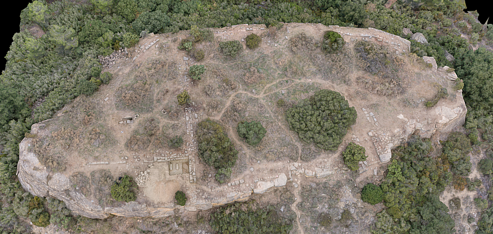
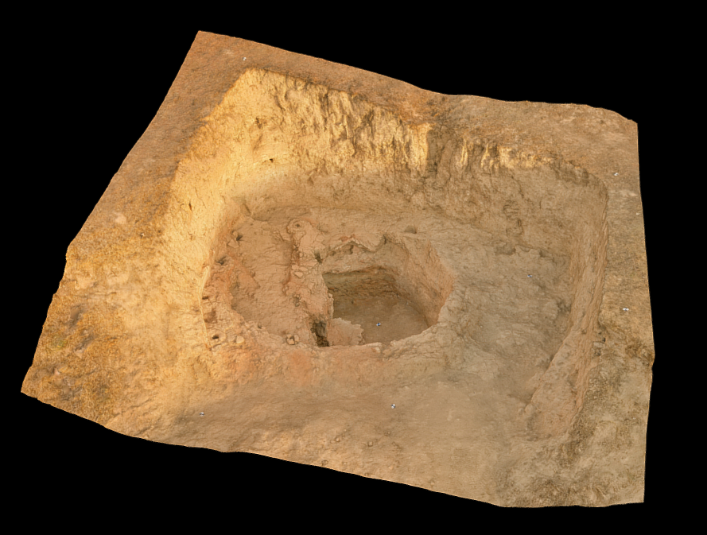
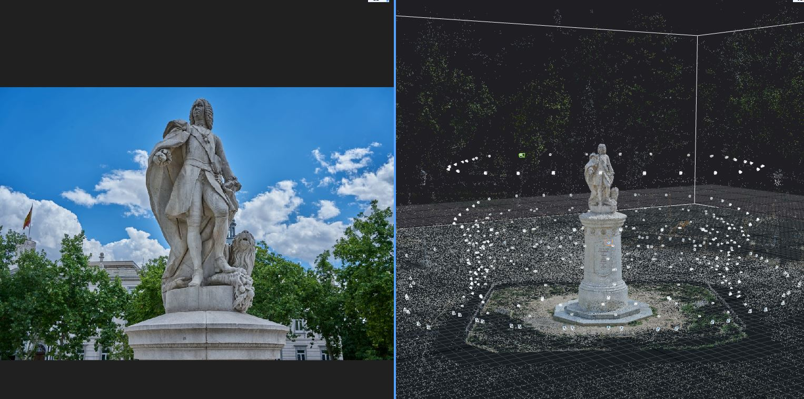
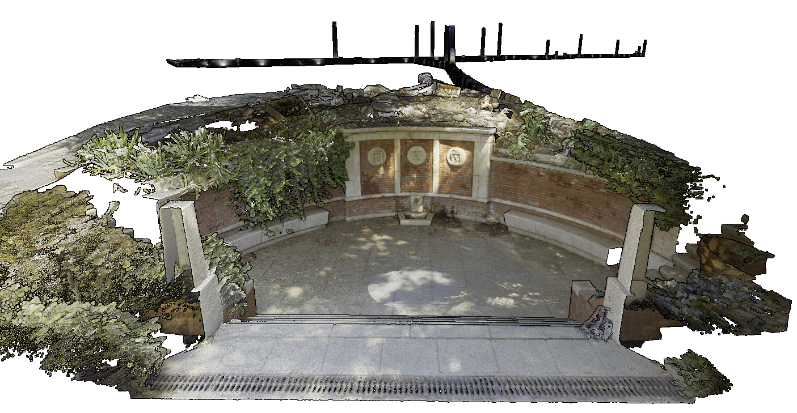

## **L'ús de les TIG en l'àmbit de la captura de realitat 3D**

Reptes i Temes Clau en Geografia

23 de novembre, 2021

---

 

Sessió en la que es mostraran diferents tecnologies i tècniques de captura massiva de dades i quina relació tenen amb les TIG a través de diferents projectes realitzats per una empresa de geomàtica

---
<!--paginate: true-->

## Hola!

<h3><a href="https://joancano.github.io">
joancano.github.io
</a></h3>

---

---
Colonia Chahilpec

---
#### **Màster TIG** (2017)

---

#### **3DSCANNER** (2017-21)

---

#### **Suport tècnic** (2017-21)

---

### **De què anem a xarrar**

- Fotogrametria
- Làser escàner
- Aplicacions / Projectes

---

<!--_backgroundColor: black-->
<!--_color: white-->
<!--_header: De què anem a xarrar -->

# Fotogrametria

---

### **Fotogrametria**

Tècnica mitjançant la qual a partir de diverses imatges amb un subjecte comú entre elles, es pot arribar a obtenir un model tridimensional amb propietats geomètriques i mètriques de qualitat molt alta

---

#### Fotogrametria. **Paral·laxi**

---

#### Fotogrametria. **Estereoscòpia**

---

### Fotogrametria

#### **Què necessite per fer fotogrametria?**

---

##### Fotogrametria amb drons

### [Ala Fixa](https://sensefly.com)

- Grans extensions
- Altura de vol: +70 m
- Resolució per píxel (cm)
- Temps de vol: llarg

---

##### Fotogrametria amb drons

### [Multirotor](https://www.dji.com/)

- Petites extensions
- Altura de vol: 10 - 120 m
- Resolució per píxel (mm)
- Temps de vol: curt

---

##### Planificació vol fotogramètric

Pix4D Capture

---

##### Planificació vol fotogramètric

 

<video src="../assets/pixplan.mp4" controls width="90%"></video>

---

##### Planificació vol fotogramètric

---

##### Planificació vol fotogramètric

---

##### Planificació vol fotogramètric

---

##### Planificació vol fotogramètric

---

##### Planificació vol fotogramètric

---

##### Planificació vol fotogramètric

[Enllaç descàrrega]()

---

##### Planificació vol fotogramètric

<a href= "https://youtu.be/LmFXOKf-TKE" ><video src=".[./assets/laPeste.mp4](https://youtu.be/LmFXOKf-TKE)" controls width="100%"></video></a>

---

### **Imatges** -> SRC **WGS84**

---

### **Imatges**

Transformació a **SRC** projectat

| Coordenades (x,y) | Unitat de mesura | Finalitat           |
| :---------------: | :--------------: | ------------------- |
|   Geogràfiques    |  Graus decimals  | Diguem on           |
|    Projectades    |      Metres      | Diguem com dibuixar |

---

### **Imatges**

Transformació d'altura **el·lipsoïdal** a **ortomètrica**

---

#### Càlcul de l'altura ortomètrica -> **H = h – N**

| var |            Altura             | Elevació                                              |
| :-: | :---------------------------: | ----------------------------------------------------- |
|  H  |      Altura ortomètrica       | elevació basada en el geoide                          |
|  h  |      Altura el·lipsoïdal      | elevació el·lipsoïdal de referència (WGS84)           |
|  n  | Altura / ondulació del geoide | elevació del model de geoide utilitzat (EGM08 REDNAP) |

---

## Formats d'entrega

| Tipus                         | Format   |
| ----------------------------- | -------- |
| Núvol de punts                | LAS      |
| Ortomosaic                    | GeoTIFF  |
| Malla 3D                      | FBX, OBJ |
| Model Digital de Superficie   | GeoTIFF  |
| Model Digital del Terreny     | GeoTIFF  |
| Ortomosaicos multiespectrales | GeoTIFF  |
| Ortomosaicos térmicos         | GeoTIFF  |

---

### Fotogrametria Terrestre

 
<video src="../assets/laPeste.mp4" controls width="90%"></video>

---

### Fotogrametria Terrestre

---

## Formats d'entrega

| Tipus                   | Format   |
| ----------------------- | -------- |
| Núvol de punts          | LAS      |
| Ortomosaic / Ortoalçats | GeoTIFF  |
| Malla 3D texturitzada   | FBX, OBJ |

---

#### Software de processament fotogramètric

---
<!--_backgroundColor: black-->
<!--_color: white-->
<!--_header: De què anem a xarrar -->
# Làser escàner

---
<!--_backgroundColor: black-->
<!--_color: red-->
### Làser escàner

---
<!--_color: white-->
### Làser escàner

---
### **Làser escàner**

---
### **Làser escàner**

---
### **Làser escàner**

---
### Tipus d'escàner

---
### Tipus d'escàner: **estàtics**

---
## Precisió

---
<!--_backgroundColor: black-->
<!--_color: white-->

### Exemple

---

### **Planificació presa de dades**

---
### Processament / Registre

---
### Processament / Registre

---

## Formats d'entrega

| Tipus                 | Format        |
| --------------------- | ------------- |
| Núvol de punts        | e57, LAS, rcp |
| Ortoalçat             | TIFF          |
| Malla 3D texturitzada | FBX, OBJ      |

---

### Fluxe de treball

---
#### **¿Fotogrametria vs Làser escàner?**

|   Presició   | Coordenades | Tipus de dades |
| :----------: | :---------: | :------------: |
|   Mètrica    |  Absolutes  | Núvol de punts |
| Centimètrica |  Relatives  |     Malla      |
| Milimètrica  |      -      |    Imatges     |

---

<!--_backgroundColor: black-->
<!--_color: white-->
<!--_header: De què anem a xarrar -->

# Examples Projectes

---

##### Seguiment glaciar [Monteperdido](https://youtu.be/LmFXOKf-TKE)

---
##### Documentació Patrimoni: **Castillo Santed**

---

##### Documentació Patrimoni: **Castillo Santed**

---

##### Documentació Patrimoni: **Castillo Santed**

---

##### Documentació Patrimoni: **Hispaniés**

---

##### Teledetecció amb drons **Seguiment plantacions**

---

##### Teledetecció amb drons **Inspecció plaques solars**

---
##### Documentació Patrimoni [**La Grotte du Bruniquel**](https://3dscanner.threedcloud.com/visor/viewer.php?tk=Bruni)

<video src="../assets/bruni.mp4" controls width="100%"></video>

---

##### Documentació Patrimoni [**La Grotte du Bruniquel**](https://3dscanner.threedcloud.com/visor/viewer.php?tk=BRUNI_360)

---

##### Documentació Patrimoni: **Presa romana Muel**

---
##### Documentació Patrimoni: **Torre Trovador**

---

##### Documentació Patrimoni: **Pavés**

---

##### Documentació Patrimoni: **Dolmen**

---

##### Documentació Patrimoni: **uzbekistán**

---
##### Documentació Patrimoni: **Azaila**

---
##### Webmapping & BD: **BD Emirats**
**Objectiu**: Inventariar gravats en roca, prendre coordenades, notes i fotografies. Requisits addicionals:
   - Edició col·lectiva
   - Registre d'usuaris
   - Control de canvis
   - Mode sense connexió
   - Estil personalitzat
---
##### Webmapping & BD: **BD Emirats**

**Solució:** Creació d'una aplicació WEB
   - Versàtil, qualsevol usuari amb un navegador actualitzat la pot utilitzar **sense necessitat de descàrrega**
   - Utilitzar les APIs que permeten l'edició offline de manera senzilla (IndexedDB, Service Workers)

---

---

---

---
<!---->

---
<!---->

---
### Conservació / restauració: **Estatues Madrid**

---

---
<!--_backgroundColor: black-->

---
<!--_backgroundColor: black-->

---
<!--_color: white-->

### Topografia / enginyeria: [Presa](https://drive.google.com/drive/folders/1HQWN_GZCStU0381rD8K9AoG18ur3-HpG?usp=sharing)

---

### Topografia / enginyeria: **Fuente del Berro**

---

### Topografia / enginyeria: **Fuente del Berro**

---

### Topografia / enginyeria

---
### Realitat virtual: **Sevilla**

<a href= "https://youtu.be/uAZ9hN7vqpg?t=173" ><video src="../assets/laPeste.mp4" controls width="100%"></video></a>

---
### Realitat virtual: **Trucho**
## **Live Demo**

---

## **Live Demo escàner**

---

# Recursos utilitzats:

- [https://marpit.marp.app/](https://github.github.com/gfm/)
- [https://asciiflow.com](https://asciiflow.com)
- [https://docs.decksetapp.com/English.lproj/getting-started.html](Decksetapp)
- [https://shd101wyy.github.io/markdown-preview-enhanced](https://shd101wyy.github.io/markdown-preview-enhanced)
- [https://garrettgman.github.io/rmarkdown/revealjs_presentation_format.html#appearance_and_style](https://garrettgman.github.io)
- [https://rawgit.com/shd101wyy/markdown-preview-enhanced/master/docs/presentation-intro.html](https://rawgit.com/shd101wyy/markdown-preview-enhanced/master/docs/presentation-intro.html)
- [https://mandieq.medium.com/beautiful-presentations-from-markdown-who-knew-it-could-be-so-easy-d279aa7f787a](https://mandieq.medium.com/beautiful-presentations-from-markdown-who-knew-it-could-be-so-easy-d279aa7f787a)
- [https://shd101wyy.github.io/markdown-preview-enhanced/#/diagrams](https://shd101wyy.github.io/markdown-preview-enhanced/#/diagrams)

---

# Recursos útils

- [CloudCompare]()
- [Meshroom]()
- [Blender]()
- [OpenDroneMap]()

---

# Gràcies

[joan.cano@3dscanner.es](joan.cano@3dscanner.es)

