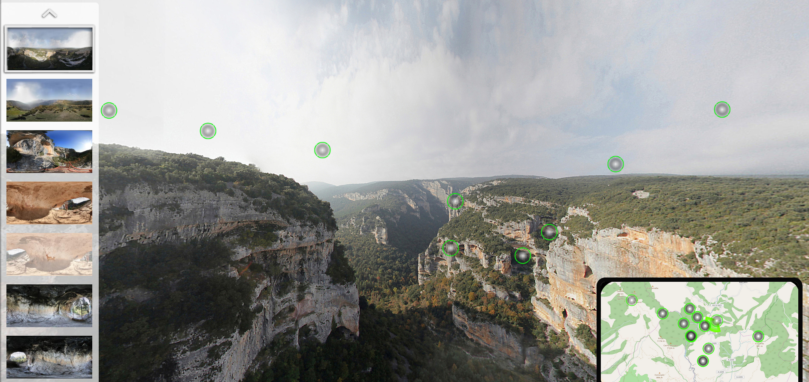

```{r setup, include=FALSE}
knitr::opts_chunk$set(echo = FALSE)
```

## 3DSCANNER
<iframe height="500" width="500" src="http://3dscanner.es"></iframe>

## Proyectos
+ Fotogrametría
  + Drones
    + Cartografía
    + Teledetección
  + Fotogrametría terrestre 
+ Láser escáner
+ 360

## Fotogrametría aérea 
<iframe width="560" height="315" src="https://www.youtube.com/embed/LmFXOKf-TKE" frameborder="0" allow="accelerometer; autoplay; encrypted-media; gyroscope; picture-in-picture" allowfullscreen></iframe>

## Fotogrametría aérea

> Técnica mediante la cual a partir de varias imágenes con un sujeto común entre ellas, se puede llegar a obtener un modelo tridimensional con propiedades geométricas y métricas de muy alta calidad

Demo Pix4D y datos procesados

## Fotogrametría terrestre
<iframe width="560" height="315" src="data/laPeste.mp4" allowfullscreen></iframe>

## Láser escáner
<iframe width="560" height="315" src="https://www.youtube.com/embed/tcMLbYdB1r4?start=8" frameborder="0" allow="accelerometer; autoplay; encrypted-media; gyroscope; picture-in-picture" allowfullscreen></iframe>


## 360
{width="640" height="380"}

[Link](https://tecnitop.threedcloud.com/visor/usuarios/3dscanner/tours/RV_Vero_2018/)

## Datos
|Precisión    |Localización   |Tipo de dato   |
|----         |---            |---            |
|Métrica      |Absoluta       |Nube de puntos |
|Centimétrica |Relativa       |Malla          |
|Milimétrica  |               |Imágenes       |
|             |               |Geometrías     |


## Visualización online
### ¿Cómo visualizo en web estos datos?
{width="640" height="380"}


## Visualización online
### Proyectos fotogramétricos

+ [Pix4D](https://cloud.pix4d.com/pro/demos)
+ [OpenDroneMap](https://www.opendronemap.org/)
  + [webodm.net](https://webodm.net/)

## Visualización online
### Nubes de puntos

<iframe height="300" width="500" src="http://www.potree.org/index.html"></iframe>

## Visualización online
### Nubes de puntos

+ [Link Potree](http://www.potree.org/index.html)
+ [Link Xampp](https://www.apachefriends.org/de/index.html)
+ [Descarga LAS](https://drive.google.com/file/d/1uJPc3gmwpZacuIGTqd8RslEdXpDdKR3D/view?usp=drivesdk)

## Visualización online
### Mallas: procesamiento
+ [Pix4D](https://www.pix4d.com/)
+ [CapturingReality](https://www.capturingreality.com/)
+ [Agisoft](https://www.agisoft.com/)
+ [Meshroom](https://alicevision.org/)


## Visualización online
### Mallas: Modelado y retopología
Software para trabajar las mallas: [Blender](https://www.blender.org/)

## Visualización online
### Mallas: visualización web
+ [Blend4web](https://www.blend4web.com/en/)
+ [Cesium](https://cesium.com/)
  + [IDE Canarias](https://visor.grafcan.es/visor3D/)
  + [Cesium Ion](https://cesium.com/ion/)
+ [ThreeJS](https://threejs.org)
+ [Babylon](https://www.babylonjs.com/)
+ [Unity](https://unity.com/es)
+ [Sketchfab](https://sketchfab.com/joancalad/models)

## Visualización online
### Imágenes

+ [ForgeJS](https://forgejs.org/)
<iframe width="560" height="315" src="https://joancano.github.io/static/projects/web/360/projectes/serrella/index.html#first-scene&uid=scene-0" allowfullscreen></iframe>

## Visualización online
### Imágenes

+ [Mapillary](https://www.mapillary.com/app/?lat=41.646881426583036&lng=-0.8860442495100642&z=18.860710080009948&panos=true&pKey=RKgBYSHTFoeaCZ0kh1CFFg&x=0.3403175671912366&y=0.515322416167532&zoom=0&focus=map)
+ [Cómo crear visores 360](https://joancano.github.io/fotografia/2019/01/02/360-photos/)


## Visualización online 
### Raster

`gdal2tiles -p mercator -z 1-8 yourmap.tif outputfolder` 

## Visualización online
### Q&A

<br>

Contacto:<br>

joancalad@gmail.com

[joancano.github.io](https://joancano.github.io/)